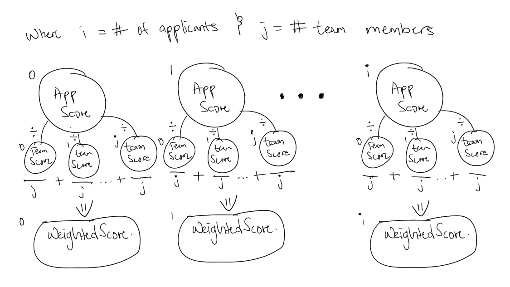

# dh-take-home-project

# HOW IT WORKS
The way I approached the solution involves looping through the "applicants" array given to us by the sample input data and then adding each of their attributes up to create a total attribute score for each applicant(ex. the applicant "John" has an intelligence of 4, strength of 5, endurance of 2, spicy food tolerance of 1, meaning that his total score is 12) and stores these values in to an array of its own. It then repeats this process for the given "team" array.

Each applicants' total score is then divided by each of the team members' total scores, added together and then divided by the total number of team members to give us the weighted score. The weighted score is an average ratio each of applicant's total score to each team member's total score. It is aimed to produce a weighted score between 0 and 1, and if it's greater than 1 then that means the applicant is considered a perfect match is considered as a weighted score of 1. (If that explanation sounded like gibberish, I have also included a personal hand-drawn picture that also used to to fully understand how I wanted to score each applicant.)

The solution then outputs a JSON string of each applicant's name and their respective weighted score on a scale of 0 to 1.

